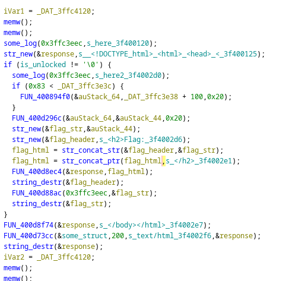

BudgetSoC Writeup
=================

justCTF 2024 Teaser (15.06.2024 - 16.06.2024)

Category: Misc, Forensics

Points: 363 (10 Solves)

Author: berndoJ, Solved together with popax21 and neverbolt

We were given the following prompt:
>We've obtained a mysterious device. Our forensic team tried to retrieve the
>original source code, but something went wrong. Fortunately, we managed to
>dump the memory into a file. Can you find what we need?

Together with a binary called `flashdump.bin`

## TL;DR

The firmware serves an HTML page with the flag, which is decrypted using a
hardcoded IV and key from an NVS key called `eeprom`. Extract the secrets,
decrypt using AES-CBC and obtain the flag.

## Overview

Similar to the preceeding challenge, `BabySoC`, the provided file is a flash
dump of an ESP32 firmware. This can be easily observed by looking at the strings
within the binary file.

By binwalking the file, we see that, contrary to the first challenge, we now
find both Rijndael AES-SBoxes within the flash contents:

```
$ binwalk flashdump.bin 

DECIMAL       HEXADECIMAL     DESCRIPTION
--------------------------------------------------------------------------------
65862         0x10146         HTML document header
66286         0x102EE         HTML document footer
69043         0x10DB3         AES Inverse S-Box
69299         0x10EB3         AES S-Box
97967         0x17EAF         Neighborly text, "neighbor entry"
131380        0x20134         SHA256 hash constants, little endian
159525        0x26F25         Intel x86 or x64 microcode, sig 0x014d061e, pf_mask 0x660660, 1D00-14-01, rev 0x-1000000, size 1
160465        0x272D1         Intel x86 or x64 microcode, sig 0x014d061e, pf_mask 0x660660, 1D00-14-01, rev 0x-1000000, size 1
```

Thus, we can already infer that we're looking for some AES-implementation that
may have something to do with finding the flag.

## Analyzing the Flash Dump

Since the raw flash dump is not really useful without the memory map defined,
we can use a tool such as [this one](https://github.com/tenable/esp32_image_parser)
to convert the raw dump into a nice ELF file which then can be further analyzed
with decompilation tools such as Ghidra.

By looking at the strings contained within the ELF, we can identify that the
firmware seems to serve some HTML content that conditionally contains the flag
in it in the function at `0x400d29b8`.



The flag string itself is produced by the function at `0x400d296c`, which takes
in memory copied originally from the internal SRAM address `0x3ffc3e38 + 100`.

By analyzing the function `0x400d296c`, we can easly see that this is some AES
decryption function (uses the AES sboxes discovered before by the binwalk) and
uses a hardcoded key and IV. Thus the AES-scheme is most likely CBC. This hints
that the input to this decryption function is some ciphertext of length `0x20`,
so two AES-blocks / 32 bytes.

By digging more into the code and analyzing XREFs near the memory location from
which the ciphertext is copied from, we find that it seems to be assigned in
`0x400d7ba8` called from the static data init function at `0x400d2bec`. This
function seems to read something from the NVS, which is a partition in the
flash image that can be used to store nonvolatile data (Non-Volatile-Storage).
More specifically, the code refers to some `eeprom` key in the NVS.

We can use the same ESP32 image parser [tool](https://github.com/tenable/esp32_image_parser)
from before to extract the NVS partition to a separate bin file and then use a
tool such as [this](https://github.com/AFontaine79/Espressif-NVS-Analyzer) to
print out the NVS contents in a structured way.

```
Namespace eeprom
  eeprom          : BLOB  74 68 69 73 69 73 6E 6F 74 61 66 6C 61 67 00 9B B0 3F AD 04 F4 5C 7C E5 BF 66 62 8A 04 5A 5A F0 45 8D C0 9F CE 60 40 C6 91 68 EF DD 26 55 65 7E A0 85 4B F0 5F FC D5 F5 04 53 15 DF 83 31 D3 D5 50 5D E1 27 45 7C 04 5E F5 DE E7 3A 01 E3 BA 3D D3 CE 90 9D 39 4F 13 18 76 C3 D8 26 AE 29 53 E4 49 9E C3 FF 3A 59 5E B5 5F CE 7A 6F B1 53 52 AA 6C E1 3A 99 8F 96 74 37 BA 2C 70 5F 6C AD A3 9D 2C 5B 54 01 FF FF FF FF FF FF FF FF FF FF FF FF FF FF FF FF FF FF FF FF FF FF FF FF FF FF FF FF FF FF FF FF FF FF FF FF FF FF FF FF FF FF FF FF FF FF FF FF FF FF FF FF FF FF FF FF FF FF FF FF FF FF FF FF FF FF FF FF FF FF FF FF FF FF FF FF FF FF FF FF FF FF FF FF FF FF FF FF FF FF FF FF FF FF FF FF FF FF FF FF FF FF FF FF FF FF FF FF FF FF FF FF FF FF FF FF FF FF FF FF FF FF FF FF FF FF FF FF FF FF FF FF FF FF FF FF FF FF FF FF FF FF FF FF FF FF FF FF FF FF FF FF FF FF FF FF FF FF FF FF FF FF FF FF FF FF FF FF FF FF FF FF FF FF FF FF FF FF FF FF FF FF FF FF FF FF FF FF FF FF FF FF FF FF FF FF FF FF FF FF FF FF FF FF FF FF FF FF FF FF FF FF FF FF FF FF FF FF FF FF FF FF FF FF FF FF FF FF FF FF FF FF FF FF FF FF FF FF FF FF FF FF FF FF FF FF FF FF FF FF FF FF FF FF FF FF FF FF FF FF FF FF FF FF FF FF FF FF FF FF FF FF FF FF FF FF FF FF FF FF FF FF FF FF FF FF FF FF FF FF FF FF FF FF FF FF FF FF FF FF FF FF FF FF FF FF FF FF FF FF FF FF FF FF FF FF FF FF FF FF FF FF FF FF FF FF FF FF FF FF FF FF FF FF FF FF FF FF FF FF FF FF FF FF FF FF FF FF FF FF FF FF FF FF FF FF FF FF FF FF FF FF FF FF FF FF FF FF FF FF FF FF FF FF FF FF FF FF FF FF 
Namespace misc
Namespace nvs.net80211
  ap.sndchan      : U8    1
  ap.authmode     : U8    3
  ap.chan         : U8    1
...
```

In the NVS, we find the `eeprom` key, which is a 132-byte large binary blob,
the `ff`'s are just empty padding. This perfectly matches the data we expect,
since we want a 32-byte ciphertext blob at the offset 100 from some string.

## Decrypting

Thus, we can use the last 32 bytes of this field, extract the key and IV from
their respective locations in the flash using Ghidra and write a quick and
simple Python script to decrypt the flag. Alternatively also possible to be done
using tools such as Cyberchef.

```python
#!/usr/bin/env python3

from Crypto.Cipher import AES

key = b"\x33\xbd\xfb\x72\x4c\x22\x87\x33\x62\xff\x75\x41\xd5\x14\xf6\xfd"
iv = b"\x00"*16
eeprom_ct = bytes.fromhex("7468697369736E6F7461666C6167009BB03FAD04F45C7CE5BF66628A045A5AF0458DC09FCE6040C69168EFDD2655657EA0854BF05FFCD5F5045315DF8331D3D5505DE127457C045EF5DEE73A01E3BA3DD3CE909D394F131876C3D826AE2953E4499EC3FF3A595EB55FCE7A6FB15352AA6CE13A998F967437BA2C705F6CADA39D2C5B5401")

cipher = AES.new(key, AES.MODE_CBC, iv)
pt = cipher.decrypt(eeprom_ct[-32:])

print(pt)
```

And we get the output

```
$ ./decrypt.py 
b'justCTF{dUmp3d_r3v3rs3d_h4ck3d}\x01'
```
